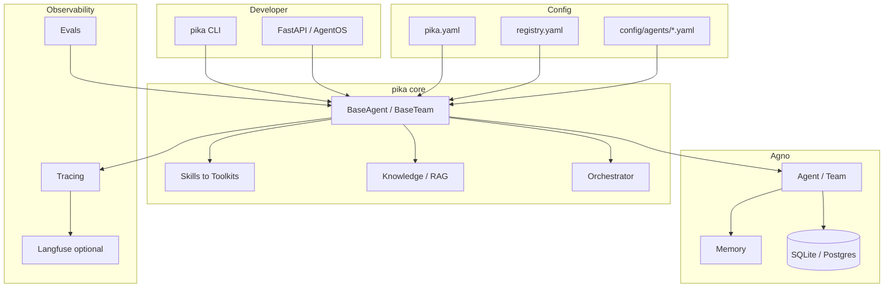

# pika

Opinionated multi-agent framework on [Agno](https://github.com/agno-agi/agno). SQLite + LanceDB by default. Zero infra to start.

## Features

| Area | What pika provides |
|------|-------------------|
| **Agents** | `BaseAgent`, class attrs + YAML config, few-shot `training_examples.yaml` |
| **Teams** | `BaseTeam`, `OrchestratorAgent` (route / plan / parallel) |
| **Skills & tools** | `BaseSkill` toolkits with `tool_instructions`, `BaseTool`, OpenAPI `pika connect` |
| **Knowledge / RAG** | LanceDB or pgvector, file/URL/DB schema ingest, OKF markdown bundles |
| **Embedder** | OpenAI, Ollama, sentence-transformers; optional offline vendored model |
| **Memory** | Agno `MemoryManager` via per-agent YAML |
| **Orchestration** | Registry-driven multi-agent routing |
| **CLI** | Scaffold, REPL (`chu`/`choo`), `serve`, `check`, `eval`, `optimize`, `knowledge`, `trace` |
| **API** | Agno AgentOS default; pika routes with JSON SSE streaming |
| **Observability** | Spans (SQLite + Langfuse SDK + OTEL/AgnoInstrumentor), eval harness, audit sink, feedback scores |
| **Optimization** | DSPy prompt optimize from training examples |
| **Corrections** | SQL + optional semantic correction store |
| **Cache** | L1 + optional Redis L2 |
| **Compat** | Opt-in Gemini/OpenRouter tool-name prefix fix |
| **Context** | Request-scoped tenant/user/role, relative date presets |

## Quickstart

```bash
cd pika
pip install -e '.[dev]'
cp .env.example .env
# set OPENAI_API_KEY in .env

pika check
pika choo                    # orchestrator (routes to best agent)
pika chu getting_started     # specific agent
```

## Architecture



## Project layout

```
pika/              # framework package
agents/            # your agents (+ training_examples.yaml, evals/)
teams/             # teams and orchestrator
skills/            # reusable skill bundles
config/            # YAML overrides (overrides/ gitignored)
registry.yaml      # agent/team manifest
pika.yaml          # global settings
scripts/           # e.g. download_embedder_model.py
```

## Configuration

**Global (`pika.yaml`)**

```yaml
observability:
  langfuse_enabled: false
compat:
  gemini_tool_names: false
context:
  timezone: UTC
  relative_dates: true
vectordb:
  provider: lancedb
  path: .lance
```

**Per-agent (`config/agents/<id>.yaml`)** — memory, knowledge, cache, corrections, `agent_kwargs`.

When a `knowledge:` block is set, pika auto-enables `search_knowledge` and `add_knowledge_to_context`.

**Few-shot (`agents/<id>/training_examples.yaml`)**

```yaml
- input: "Summarize this"
  output: "Here is a concise summary..."
```

Loaded at agent init and used by `pika optimize`.

## CLI

| Command | Description |
|---|---|
| `pika new agent <name>` | Scaffold agent |
| `pika new tool <name>` | Scaffold tool |
| `pika init` | Scaffold new pika project |
| `pika connect <url> --name <tool>` | OpenAPI → tool stubs |
| `pika run` / `chu` / `choo` | Interactive REPL |
| `pika serve` | AgentOS API server |
| `pika check` | Validate `registry.yaml` |
| `pika eval <agent_id>` | YAML eval suite (add `--live` for LLM) |
| `pika optimize <agent_id>` | DSPy prompt optimize |
| `pika knowledge add/list/add-db` | RAG ingest |
| `pika trace list/show` | Inspect stored spans |

Aliases: `pikachu`, `pikachoo`, `pika-chu`, `pika-choo`.

## Knowledge & RAG

```bash
pika knowledge add my_agent --path ./docs/
pika knowledge add-db my_agent --db-url postgresql://...
pika knowledge add my_agent --format okf --path ./knowledge/tables/
```

Pair with `DatabaseSkill` for semantic search vs live SQL (see `research_agent`).

**Offline embedder**

```bash
pip install -e '.[embedder]'
python scripts/download_embedder_model.py
```

## Evals

```yaml
# agents/my_agent/evals/questions.yaml
questions:
  - id: smoke
    input: "Hello"
    expect_contains: ["hi"]
    context:
      role: demo_user
```

```bash
pika eval getting_started          # validate YAML
pika eval getting_started --live   # run against LLM
```

## Serve API

```bash
pika serve --port 8080
```

- Default: Agno AgentOS (REST + WebSocket for agents/teams)
- `pika serve --no-os`: pika-only routes with JSON SSE (`/agents/{id}/stream`)

Identity headers (dev): `X-User-ID`, `X-Tenant-ID`, `X-Role`. Prefer auth context over body `user_id`.

## Observability

**Langfuse — two modes**

| Mode | Setup | What you see |
|------|-------|--------------|
| SDK spans | `langfuse_enabled: true` | pika cache/corrections/run spans |
| OTEL + AgnoInstrumentor | `pip install -e '.[langfuse]'` + keys | Full Agno hierarchy: generations, tools |

```bash
LANGFUSE_ENABLED=true
LANGFUSE_PUBLIC_KEY=pk-lf-...
LANGFUSE_SECRET_KEY=sk-lf-...
```

`pika serve` calls `install_langfuse_otel()` before agents load.

## Optional extras

| Extra | Install | Enables |
|-------|---------|---------|
| `dev` | `pip install -e '.[dev]'` | pytest, ruff, pre-commit |
| `redis` | `.[redis]` | L2 response cache |
| `postgres` | `.[postgres]` | Postgres + pgvector |
| `embedder` | `.[embedder]` | Local sentence-transformers RAG |
| `dspy` | `.[dspy]` | `pika optimize` |
| `langfuse` | `.[langfuse]` | Langfuse OTEL + Agno instrumentation |
| `otel` | `.[otel]` | OpenTelemetry export |
| `all` | `.[all]` | Everything above |

## Development

```bash
pytest
ruff check .
pika check
```

## License

MIT
